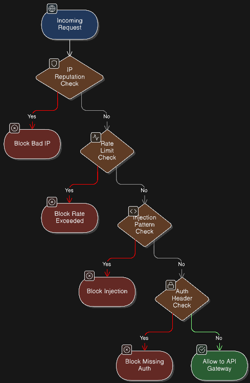
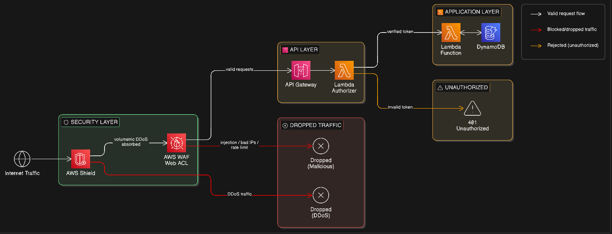

# AWS WAF + Shield: Protecting Your Serverless APIs from Real-World Attacks

In the last article, we built a secure serverless API using Lambda, API Gateway, and IAM — scoping permissions tightly, one function per endpoint, no wildcards in production. That gets your internal security posture right. But it doesn't do anything about what's coming from the outside.

And things will come from the outside.

This article covers how AWS WAF and AWS Shield address that external threat surface, how to actually set them up (not just what they are), and what I've learned from running both in production environments that get hit regularly.

## What Actually Attacks Your Serverless API

Before we talk about defenses, let's be concrete about threats. The traffic hitting your API Gateway endpoint isn't just real users.

**Automated scanners** probe for known vulnerabilities the moment a new endpoint becomes publicly reachable. Tools like Nuclei, Shodan crawlers, and commercial attack scanners run continuously. Your API will get fingerprinted within hours of deployment — sometimes minutes.

**Injection attacks** — SQL injection, XSS, command injection — still get attempted constantly even when they don't make sense for your stack. If your Lambda doesn't use a SQL database, attackers don't know that. They'll try anyway, hitting every endpoint with templated payloads.

**Credential stuffing** takes leaked username/password combinations from other breaches and hammers your login or auth endpoints. One breach on a third-party site can translate to thousands of auth attempts against yours within 24 hours.

**Layer 7 floods** are particularly nasty for serverless because they look like legitimate traffic. Valid HTTP requests, sent at high volume, hit your business logic, trigger Lambda invocations, and burn through concurrency limits. The billing impact alone can be significant. Serverless doesn't protect you from cost amplification attacks — every invocation costs something.

AWS WAF handles the first three categories. AWS Shield handles volumetric DDoS. You want both.

## What AWS WAF Actually Does

AWS WAF is a web application firewall that sits in front of API Gateway (or CloudFront, or an ALB) and evaluates every incoming HTTP request against a set of rules before anything reaches your backend.

It's not magic. It's a rule engine. For each request, WAF checks headers, query strings, URI paths, request body content, IP addresses, and geographic origin — then decides to allow, block, or count the request based on rules you define or subscribe to.

What it does well:
- Blocks requests matching known attack signatures (OWASP Top 10 patterns, known CVEs)
- Rate-limits traffic from individual IPs
- Blocks or allows traffic based on IP reputation lists or geo-location
- Logs every request evaluation so you can actually see what's hitting you

What it doesn't do: replace input validation in your application code, catch novel zero-days before AWS updates the managed rules, or protect against vulnerabilities in your own business logic. WAF is one layer, not a complete solution.

Here's how a single request moves through WAF evaluation before anything downstream sees it:



Rules are evaluated in priority order. The first match wins. A request that clears every rule gets through — everything else gets dropped before touching your infrastructure.

## Setting Up AWS WAF in Front of API Gateway

Here's a Terraform config I use as a starting point for every API I deploy. It attaches a WAF Web ACL to an API Gateway stage with the core managed rules and a per-IP rate limit:

```hcl
resource "aws_wafv2_web_acl" "api_waf" {
  name  = "api-gateway-waf"
  scope = "REGIONAL"

  default_action {
    allow {}
  }

  rule {
    name     = "AWSManagedRulesCommonRuleSet"
    priority = 1

    override_action {
      none {}
    }

    statement {
      managed_rule_group_statement {
        name        = "AWSManagedRulesCommonRuleSet"
        vendor_name = "AWS"
      }
    }

    visibility_config {
      cloudwatch_metrics_enabled = true
      metric_name                = "CommonRuleSetMetric"
      sampled_requests_enabled   = true
    }
  }

  rule {
    name     = "RateLimitPerIP"
    priority = 2

    action {
      block {}
    }

    statement {
      rate_based_statement {
        limit              = 1000
        aggregate_key_type = "IP"
      }
    }

    visibility_config {
      cloudwatch_metrics_enabled = true
      metric_name                = "RateLimitMetric"
      sampled_requests_enabled   = true
    }
  }

  visibility_config {
    cloudwatch_metrics_enabled = true
    metric_name                = "ApiWafMetric"
    sampled_requests_enabled   = true
  }
}

resource "aws_wafv2_web_acl_association" "api_waf_association" {
  resource_arn = aws_api_gateway_stage.prod.arn
  web_acl_arn  = aws_wafv2_web_acl.api_waf.arn
}
```

A few things worth noting. `scope = "REGIONAL"` is correct for API Gateway — use `CLOUDFRONT` only when attaching to a CloudFront distribution. The default action is `allow`, meaning anything that doesn't match a rule passes through. Your rules do the blocking.

The rate limit of 1000 requests per 5-minute window per IP is a reasonable starting point for most APIs. If you're running a high-traffic public endpoint, tune it up. If you're building something sensitive like an auth flow, tighten it considerably — 100 requests per 5 minutes is more appropriate for a login endpoint.

## WAF Rule Groups: Managed vs Custom

AWS maintains a set of managed rule groups, updated by their security team as new threats emerge. For most teams, **AWSManagedRulesCommonRuleSet** is the right first layer — it covers SQL injection, XSS, path traversal, and other OWASP Top 10 patterns.

Additional managed groups worth adding depending on your stack:

- **AWSManagedRulesKnownBadInputsRuleSet** — blocks exploitation attempts for Log4Shell, Spring4Shell, and other major CVEs. Worth adding for almost everyone.
- **AWSManagedRulesSQLiRuleSet** — deeper SQL injection detection if your Lambda touches a relational database.
- **AWSManagedRulesAmazonIpReputationList** — blocks IPs on Amazon's threat intelligence lists: known bots, scrapers, and bad actors. Free and highly effective.

Custom rules are where you encode your own access patterns. Here's one I use to block any request missing an `Authorization` header at the WAF layer, before it ever reaches API Gateway:

```hcl
rule {
  name     = "BlockMissingAuthHeader"
  priority = 3

  action {
    block {}
  }

  statement {
    not_statement {
      statement {
        byte_match_statement {
          field_to_match {
            single_header {
              name = "authorization"
            }
          }
          positional_constraint = "EXISTS"
          search_string         = ""
          text_transformation {
            priority = 0
            type     = "NONE"
          }
        }
      }
    }
  }

  visibility_config {
    cloudwatch_metrics_enabled = true
    metric_name                = "MissingAuthHeaderMetric"
    sampled_requests_enabled   = true
  }
}
```

This drops unauthenticated requests before they consume Lambda invocations, API Gateway processing, or anything else. Cheap at the WAF layer; expensive if they get through.

My recommendation on rollout: start with the two or three core managed rule groups, but set `override_action` to `count` instead of blocking for the first week. Analyze the sampled requests in CloudWatch, look for false positives, then flip to block. Skipping this step is how you end up with a WAF rule that's silently breaking your mobile app.

## AWS Shield: Standard vs Advanced

Every AWS account gets **Shield Standard** automatically, at no cost. It protects against common volumetric DDoS attacks at the network and transport layers — UDP floods, SYN floods, reflection attacks. It works passively in the background and you don't need to configure anything to get it.

**Shield Advanced** is a paid service ($3,000/month plus data transfer fees) that adds:

- Layer 7 DDoS protection with automatic WAF rule creation during an active attack
- DDoS cost protection — AWS credits any AWS infrastructure costs incurred because of a DDoS event
- 24/7 access to the AWS DDoS Response Team (DRT)
- Richer attack telemetry and dashboards

When do you actually need Advanced? If your API is a commercial product where downtime directly costs revenue, or you're in a sector that attracts targeted attacks (fintech, gaming, crypto, political platforms), the cost-protection clause alone can justify the subscription. I've seen single DDoS incidents cause Lambda and API Gateway costs to spike by tens of thousands of dollars before throttles kicked in. Shield Advanced can get that refunded.

For early-stage products, internal tools, or APIs with modest traffic, Shield Standard plus WAF rate limiting is sufficient. Don't pay for Advanced just because it exists — but if you're running something with real uptime SLAs, evaluate it seriously.

| Feature | Shield Standard | Shield Advanced ($3,000/mo) |
| :--- | :--- | :--- |
| **L3 / L4 Network Protection** | Included | Included |
| **Volumetric Flood Mitigation** | Included | Included |
| **Always On (Zero Config)** | Included | Included |
| **Layer 7 DDoS Protection** | No | Included |
| **DDoS Cost Protection / Refunds** | No | Included |
| **DRT 24/7 Emergency Access** | No | Included |
| **Auto WAF Rule Updates** | No | Included |

## How WAF + Shield Work Together

These services operate at different layers, which is the whole point. Shield handles volumetric attacks at the network level — traffic that should never reach your application. WAF handles application-layer threats — requests that look legitimate at the network level but contain malicious payloads.

Here's the full traffic flow with both in place:



The result is layered defense: no single control point handles everything, and a request has to clear multiple independent checkpoints to reach your business logic. This is what defense-in-depth looks like in practice, not as a diagram on a whiteboard but as actual infrastructure.

## Real-World Tips

Things I've learned from running WAF in production that aren't in the documentation:

**Always run count mode before block mode.** The AWS managed rule groups have false positives. I've seen legitimate mobile app traffic hit the common rule set because of non-standard user agent strings. I've seen internal health checks get flagged by the SQL injection rules because of query string formatting. Run count mode for at least a week, review what's being flagged, then enable blocking. This is not optional if you care about availability.

**Set up WAF logging to S3.** WAF can log every request inspection result to an S3 bucket. Pair it with Athena and you can query things like "show me all blocked requests from the past 24 hours that weren't from my known bot IPs." This is how you distinguish false positives from actual attacks during an incident. Setting this up after you need it is too late.

**Rate limits are per rule, not global.** If you have multiple rate-limit rules, each one tracks independently. Be intentional about applying tighter limits to sensitive endpoints like `/login`, `/reset-password`, or anything that triggers account actions, versus more permissive limits on read-heavy public endpoints.

**WAF and API Gateway throttling are separate controls.** Configure both. WAF is your outer perimeter; API Gateway throttling is a backstop. If WAF has a rule misconfigured and lets something through, the API Gateway usage plan throttle can still save you from runaway Lambda invocations.

**The DRT is worth the call.** If you're on Shield Advanced and under an active attack, call the DRT immediately. They have telemetry and pattern data you won't have, and they can push WAF rule updates to your Web ACL faster than you can figure out what the attack looks like. I've seen teams spend 90 minutes debugging attack traffic that the DRT could have characterized in 10.

## Key Takeaways

- **AWS WAF is inexpensive and fast to set up.** A public API without WAF is a choice you'll eventually regret.
- **Start with AWSManagedRulesCommonRuleSet and a per-IP rate limit.** Those two rules block the majority of automated attack traffic.
- **Count mode first, then block mode.** False positives will cause production incidents if you skip this.
- **Shield Standard is automatic and covers volumetric attacks.** Shield Advanced is worth evaluating if you have uptime SLAs or operate in high-threat industries.
- **WAF and Shield solve different problems at different layers.** They complement each other — you want both.
- **Log everything WAF evaluates.** The logs are how you understand your actual threat landscape.

With WAF and Shield in front of the architecture we built in Article 1, the perimeter is solid. In the next article, we'll move inside that perimeter: securing Lambda-to-Lambda communication, managing secrets correctly with Secrets Manager and Parameter Store, and setting up detection and response for when something does get through. Because it eventually will.