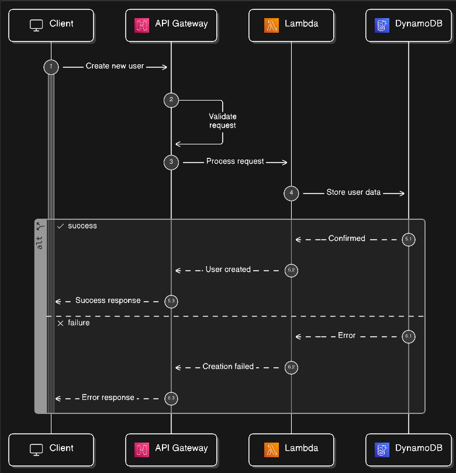
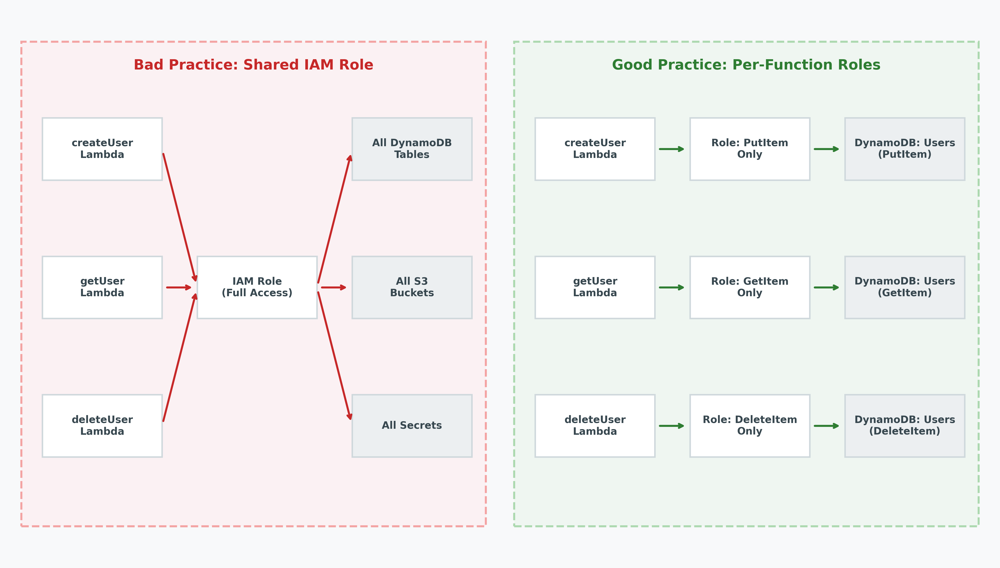
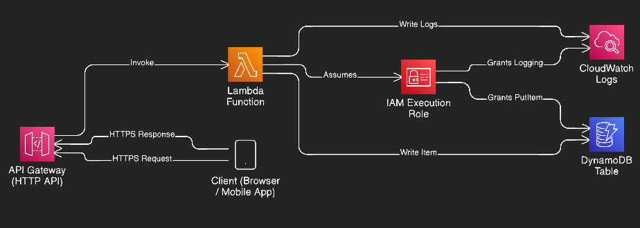

# Building a Secure Serverless API on AWS: Lambda, API Gateway, and IAM the Right Way

Every few years, something shifts in how we build backends. Containers changed the game. Kubernetes made it more complex. And now serverless is quietly solving a problem most teams didn't even know they had: *they were spending half their engineering time babysitting infrastructure instead of shipping features.*

I'm not here to sell you on serverless. If you've landed on this article, you're probably already past the "should we?" stage and into the "how do we do this without shooting ourselves in the foot?" stage. Good. That's exactly what we'll cover.

We're going to build a secure serverless API on AWS using Lambda, API Gateway, and IAM. And we're going to do it the way you'd actually want it running in production, not the way most tutorials show it.

## What Is Serverless, Really?

Let's skip the marketing pitch. Serverless doesn't mean "no servers." It means *you don't manage them.* AWS runs the compute, patches the OS, handles scaling, and you pay only when your code actually runs. That's it.

In practice, a serverless API on AWS usually means three things working together:

- **AWS Lambda** runs your code in response to events.
- **API Gateway** exposes HTTP endpoints and routes requests to Lambda.
- **IAM** controls who can do what. This is where most teams get it wrong.

The appeal is straightforward: no EC2 instances to patch, no auto-scaling groups to tune, no idle servers burning your budget at 3 AM. You write a function, attach it to an endpoint, and it scales from zero to thousands of concurrent requests without intervention.

But "easy to start" doesn't mean "easy to get right." The security side takes actual thought.

## Setting Up AWS Lambda

Let's build a simple API endpoint: a Lambda function that receives a request, processes it, and returns a response. Nothing fancy, but structured like you'd want it in a real project.

Here's roughly what I use in production. It's a Python Lambda function that handles a `POST` request to create a user:

```python
import json
import uuid
import boto3
from datetime import datetime

dynamodb = boto3.resource("dynamodb")
table = dynamodb.Table("Users")


def handler(event, context):
    try:
        body = json.loads(event.get("body", "{}"))
        email = body.get("email")

        if not email:
            return {
                "statusCode": 400,
                "headers": {"Content-Type": "application/json"},
                "body": json.dumps({"error": "Email is required"}),
            }

        user_id = str(uuid.uuid4())
        item = {
            "userId": user_id,
            "email": email,
            "createdAt": datetime.utcnow().isoformat(),
        }

        table.put_item(Item=item)

        return {
            "statusCode": 201,
            "headers": {"Content-Type": "application/json"},
            "body": json.dumps({"userId": user_id, "email": email}),
        }

    except Exception as e:
        print(f"Error processing request: {str(e)}")
        return {
            "statusCode": 500,
            "headers": {"Content-Type": "application/json"},
            "body": json.dumps({"error": "Internal server error"}),
        }
```

A few things worth noting here. The function doesn't expose raw exception details to the caller. That's a security basic that a surprising number of tutorials ignore. We're returning proper status codes, and the DynamoDB client is initialized outside the handler so it gets reused across warm invocations. That last part matters more than people think for both performance and connection management.

When deploying this, set the runtime to Python 3.12, keep the memory at 128 MB to start (you can tune later), and set the timeout to something sane like 10 seconds. The default 3-second timeout will bite you when DynamoDB has a slow moment.

## Connecting API Gateway to Lambda

API Gateway is the front door to your Lambda function. When a client sends an HTTP request, API Gateway receives it, transforms it into a Lambda event, invokes your function, and returns the response.

Here's how the flow works in practice:

1. A client sends a `POST` request to `https://your-api-id.execute-api.us-east-1.amazonaws.com/prod/users`.
2. API Gateway matches the route and method.
3. It invokes your Lambda function, passing the request as an event object (that's the `event` parameter in the handler).
4. Lambda processes the request, returns a response object.
5. API Gateway maps that response back to an HTTP response and sends it to the client.



Use HTTP API (the newer type) over REST API unless you specifically need features like request validation, WAF integration, or usage plans. HTTP APIs are cheaper, faster, and simpler to configure. For most CRUD APIs, they're the right choice.

One mistake I've seen teams make: they create a single Lambda function and route all API paths to it, using internal routing logic to fan out. This defeats half the purpose of serverless. Each endpoint should ideally map to its own function. It keeps permissions tight, deployments independent, and debugging much simpler.

## IAM Roles and Least Privilege

This is where security lives or dies in a serverless setup, and where I've seen the most damage done.

Every Lambda function runs under an IAM execution role. That role determines what AWS services the function can access. The default behavior most teams follow, either by laziness or by copying Stack Overflow answers, is to slap a broad policy on the role and move on.

**Don't do this.** Here's the kind of policy I write for every function, scoped tight to exactly what it needs:

```json
{
  "Version": "2012-10-17",
  "Statement": [
    {
      "Sid": "AllowDynamoDBWriteOnly",
      "Effect": "Allow",
      "Action": [
        "dynamodb:PutItem"
      ],
      "Resource": "arn:aws:dynamodb:us-east-1:123456789012:table/Users"
    },
    {
      "Sid": "AllowCloudWatchLogs",
      "Effect": "Allow",
      "Action": [
        "logs:CreateLogGroup",
        "logs:CreateLogStream",
        "logs:PutLogEvents"
      ],
      "Resource": "arn:aws:logs:us-east-1:123456789012:log-group:/aws/lambda/createUser:*"
    }
  ]
}
```

Notice what this policy *doesn't* allow. No `dynamodb:*`. No `Scan`, no `DeleteItem`, no `UpdateItem`. The function writes a new user, so it gets `PutItem` on that one table and nothing else. The CloudWatch permissions are scoped to that function's specific log group, not to all logs in the account.

**Common mistakes I keep running into:**

- **Using `"Resource": "*"`** which hands the function the keys to every resource of that type in your entire AWS account. I've seen production setups where a single Lambda could read every DynamoDB table, every S3 bucket, and every secret in Secrets Manager. One compromised dependency and you've got a real problem.
- **Sharing a single IAM role across all Lambda functions.** If your read-user function has the same permissions as your delete-user function, you've created an unnecessarily large blast radius. Each function gets its own role. Yes, it's more to manage. Use infrastructure-as-code and it takes two extra lines per function.
- **Leaving `AmazonDynamoDBFullAccess` or similar AWS managed policies attached.** These are convenient for prototyping. They're dangerous in production. Replace them with custom policies before you go live.

Here's the difference visually. On the left is what I see in most audits. On the right is how it should look:



Think of IAM as a firewall for your function's capabilities. You wouldn't leave all ports open on a server, so don't leave all API actions open on a Lambda role.

## Architecture Overview

Here's how all the pieces fit together in a typical secure serverless API setup:



The client never talks to Lambda directly. API Gateway handles TLS termination, request validation, and throttling. Lambda assumes its IAM role at invocation time and doesn't store credentials. DynamoDB and CloudWatch are accessed through that role's permissions, and nothing else.

If you're adding authentication, slot Amazon Cognito or a custom Lambda authorizer between API Gateway and your function. That adds a verification step before your business logic ever runs.

## Real-World Tips From Production

These are things that don't show up in "Getting Started" tutorials but will save you time and headaches when you're running a secure serverless API in production.

**Cold starts are real, but usually overstated.** Python and Node.js functions cold-start in under a second for most workloads. If sub-100ms latency is critical for every request, use provisioned concurrency, but measure first before spending the money. I've seen teams provision concurrency for endpoints that get 10 requests per minute.

**Set up a WAF in front of API Gateway.** AWS WAF lets you block common attack patterns like SQL injection, XSS, and known bad IPs before they ever hit your Lambda. It takes 15 minutes to set up with the core managed rule set, and there's no good reason to skip it.

**Don't log sensitive data.** Your Lambda function will write to CloudWatch by default. Make sure request bodies with passwords, tokens, or PII are stripped before they hit `print()` or your logging library. I've personally audited systems where full API keys were sitting in CloudWatch logs with a 30-day retention.

**Use environment variables for config, not hardcoded values.** API keys, table names, feature flags: all should come from environment variables or AWS Systems Manager Parameter Store. For actual secrets (database passwords, third-party API keys), use Secrets Manager. Never put credentials in your code, even in a private repo.

**Version and alias your Lambda functions.** Don't deploy directly to `$LATEST` in production. Use aliases like `prod` and `staging` mapped to specific function versions. This gives you instant rollback capability when a deploy goes sideways. And it will eventually.

**Monitor with structured logs and alarms.** Set up CloudWatch alarms for error rates and duration spikes from day one. It's much easier to set up monitoring when you have three functions than when you have thirty. Use structured JSON logging so your logs are actually searchable.

## Key Takeaways

Building a secure serverless API on AWS isn't complicated, but it does require you to be deliberate about a few things that are easy to skip:

- **One function, one purpose, one IAM role.** Keep the blast radius small.
- **Scope IAM policies to the exact actions and resources each function needs.** No wildcards in production.
- **Use HTTP API type in API Gateway** unless you have a specific reason for REST API.
- **Put a WAF in front of your API.** It's cheap and catches the obvious stuff.
- **Don't log secrets.** Audit your CloudWatch logs regularly.
- **Version your deployments** so you can roll back without panic.

Serverless lets you move fast. IAM done right makes sure you move fast without leaving the door open behind you. Get these foundations right at the start, and you'll thank yourself six months from now when the first security review comes around.
