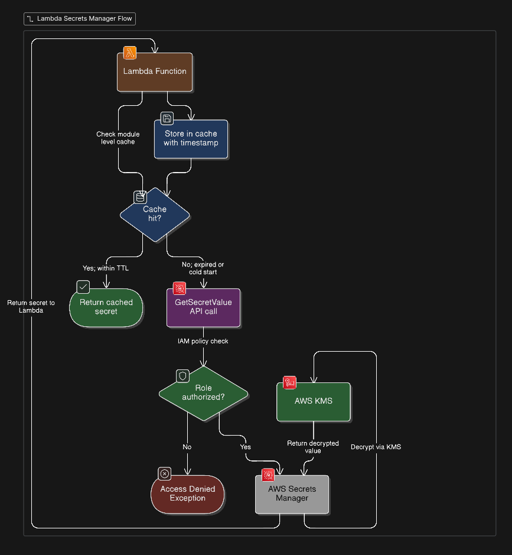

# Secrets Management for Serverless Apps: AWS Secrets Manager + Lambda Done Properly

We've covered a lot of ground in this series. In Article 1, we built a secure serverless API with Lambda, API Gateway, and tightly scoped IAM roles, the structural foundation. In Article 2, we put AWS WAF and Shield in front of that API to handle the threats coming from the outside. Now we're moving inside the perimeter, to the problem that quietly undermines serverless security more than anything else.

Where do your secrets live?

I've seen teams store database passwords as Lambda environment variables and call it done. I've seen connection strings hardcoded in functions sitting in private repos. I've watched an internal Slack channel become the de facto credentials store because "it's fine, only engineers are in here." These aren't horror stories from careless teams, they're the path of least resistance when no one has set up a better option.

This article covers how to stop doing that. We'll go through AWS Secrets Manager: what it actually is, how to wire it up with Lambda properly, the caching pattern most tutorials skip, automatic rotation, and when Parameter Store is the better call.

## Why Environment Variables Aren't Enough

Environment variables feel like the right answer. They keep secrets out of code, every runtime supports them, and the Lambda console makes them easy to set. The problem is several layers deeper than most teams think about.

**They're visible in the console to anyone with Lambda read access.** Your IAM policies may not be as tight as the ones we set up in Article 1. If any role in your account has `lambda:GetFunctionConfiguration`, those env var values are readable.

**They end up in Terraform state.** If you're managing Lambda configuration with Terraform (and you should be), environment variable values get written to `terraform.tfstate` in plaintext. If that state file lives in S3 without tight access controls, or worse, in a git repo, the secret is exposed to everyone who has access to that file.

**There's no rotation story.** If a database password stored as an environment variable gets compromised, rotating it means updating every Lambda function that uses it and redeploying. That friction means rotation doesn't happen, and a secret that should have a 90-day lifespan ends up living for two years because nobody wants to touch it.

**They're easy to log by accident.** I've personally audited systems where `print(os.environ)` sat in a debugging block that never got removed, with a 90-day CloudWatch retention window sitting underneath it.

Environment variables are fine for non-sensitive configuration: table names, log levels, feature flags. For actual credentials, you need a tool designed for the job.

## What AWS Secrets Manager Actually Does

Secrets Manager is a managed service for storing, retrieving, and rotating sensitive values. That description undersells it, so let's be specific.

Secrets are encrypted at rest using KMS. Every fetch is an authenticated API call; your Lambda needs explicit IAM permission to retrieve a specific secret, and nothing has access by default. There's a full audit trail in CloudTrail for every access event. And rotation is built in, with native support for RDS, Redshift, and DocumentDB, plus a Lambda-based mechanism for anything else.

The mental model shift is this: instead of a secret living statically in your function's configuration at deploy time, it lives in Secrets Manager and your function fetches it at runtime. That indirection is where the security comes from. The credentials never touch your deployment pipeline, your Terraform state doesn't hold live passwords, and access is controlled by the same IAM policies you're already managing.

## Setting Up Secrets Manager with Terraform

Here's a configuration I use as a starting point. It creates a secret, stores credentials as a JSON object, and grants a specific Lambda role permission to read it, and nothing else:

```hcl
resource "aws_secretsmanager_secret" "db_credentials" {
  name                    = "prod/myapp/db-credentials"
  description             = "RDS credentials for production app database"
  recovery_window_in_days = 7
}

resource "aws_secretsmanager_secret_version" "db_credentials_value" {
  secret_id = aws_secretsmanager_secret.db_credentials.id
  secret_string = jsonencode({
    username = var.db_username
    password = var.db_password
    host     = var.db_host
    port     = 5432
    dbname   = var.db_name
  })
}

data "aws_iam_policy_document" "lambda_secrets_policy" {
  statement {
    sid     = "AllowSecretsManagerRead"
    effect  = "Allow"
    actions = ["secretsmanager:GetSecretValue"]
    resources = [
      aws_secretsmanager_secret.db_credentials.arn
    ]
  }

  statement {
    sid     = "AllowKMSDecrypt"
    effect  = "Allow"
    actions = ["kms:Decrypt"]
    resources = [aws_kms_key.secrets_key.arn]
  }
}

resource "aws_iam_role_policy" "lambda_secrets" {
  name   = "lambda-secrets-access"
  role   = aws_iam_role.lambda_exec.name
  policy = data.aws_iam_policy_document.lambda_secrets_policy.json
}
```

Notice the policy allows `GetSecretValue` only on the specific secret ARN, not `secretsmanager:*`, and not all secrets in the account. One role, one secret. The `kms:Decrypt` permission is needed if you're using a customer-managed KMS key, which you should be in production. The AWS-managed default key works, but a CMK gives you control over who can use it and when it can be revoked.

## Integrating Secrets Manager with Lambda

Most code examples fetch a secret on every invocation. That works, but Secrets Manager charges per API call and adds latency on every request. The right pattern uses a module-level cache:

```python
import json
import os
import time
import boto3
from botocore.exceptions import ClientError

_sm_client = boto3.client("secretsmanager", region_name="us-east-1")
_secret_cache = {}
CACHE_TTL_SECONDS = 300  # 5 minutes


def get_secret(secret_name: str) -> dict:
    now = time.time()
    cached = _secret_cache.get(secret_name)

    if cached and (now - cached["fetched_at"]) < CACHE_TTL_SECONDS:
        return cached["value"]

    try:
        response = _sm_client.get_secret_value(SecretId=secret_name)
        secret = json.loads(response["SecretString"])
        _secret_cache[secret_name] = {"value": secret, "fetched_at": now}
        return secret
    except ClientError as e:
        raise RuntimeError(f"Failed to retrieve secret: {e}") from e


def handler(event, context):
    secret_name = os.environ["DB_SECRET_NAME"]
    db_creds = get_secret(secret_name)

    # db_creds["username"], db_creds["password"], db_creds["host"] are now available
    # Connect to the database and proceed normally
```

The `_secret_cache` dict persists across warm Lambda invocations because it lives at module level, outside the handler. Cold starts fetch from Secrets Manager. Subsequent warm invocations read from memory until the TTL expires. At 5 minutes, rotation changes propagate within one TTL window without hammering the API.

The secret name comes from an environment variable, not hardcoded. The function doesn't need to know the actual credentials at deploy time, just which secret to ask for at runtime.

## Secret Rotation

This is where Secrets Manager earns its cost. You define a rotation schedule, and Secrets Manager generates new credentials, updates the secret, and applies the change to the target system automatically. For supported databases, RDS MySQL, PostgreSQL, Aurora, Redshift, the full rotation flow works with no custom code. For everything else, you write a small rotation Lambda using one of the AWS-provided templates.

The practical argument for rotation isn't just compliance. If a database password gets exposed through a log leak, a compromised CI pipeline, or a contractor with too much access, your blast radius is bounded by your rotation window. A secret that rotates every 30 days gives an attacker a limited window. A secret that's never rotated gives them unlimited time.

Enable rotation on anything that can be rotated. Set the interval to 30 days or tighter for high-value credentials. The 5-minute cache TTL in the Lambda code above means rotation changes are picked up well within any reasonable window.

## AWS Systems Manager Parameter Store: When to Use It Instead

Parameter Store is the quieter option. It stores configuration values and secrets, integrates with IAM, and is free for standard parameters (up to 4KB, with no rotation, no cross-account access, no native rotation support).

The practical split:

- **Use Parameter Store** for non-sensitive configuration that varies by environment: database hostnames, queue URLs, feature flag values, log levels. These don't need rotation. The free standard tier handles them cleanly.
- **Use Secrets Manager** for anything that needs rotation, an audit trail, or fine-grained access control: database passwords, third-party API keys, OAuth client secrets, certificate private keys.

Secrets Manager costs $0.40 per secret per month. For 10–20 credentials, that's noise. For 200 config values, Parameter Store is the better fit for anything that isn't genuinely sensitive. The retrieval code is nearly identical between the two services, so using both doesn't add much overhead.

## Architecture: How the Retrieval Flow Works



The IAM check is non-negotiable. There's no way to retrieve a secret value without a role explicitly authorized to do so. KMS decryption happens server-side and the value reaches your function over TLS. The cache layer sits entirely in Lambda's memory and never writes credentials anywhere external.

## Real-World Tips

Things that don't appear in the AWS documentation but matter when you're running this in production:

**Name secrets with a path structure.** Use `prod/myapp/db-credentials` instead of `myapp-prod-db-credentials`. Paths let you write IAM policies that scope access by environment, your production Lambda role gets `prod/*` and nothing else. Your staging role gets `staging/*`. This is much cleaner to maintain than managing per-secret ARNs in every policy.

**Never fetch secrets inside a loop.** If your handler processes a batch of records and calls `get_secret()` per record without the caching layer, you'll hit Secrets Manager API rate limits under load. Fetch once per cold start. The cache handles the rest.

**Add a VPC endpoint if your Lambda runs in a VPC.** Without it, every `GetSecretValue` call routes through the public internet and arequires a NAT gateway. The VPC endpoint keeps that traffic on AWS's private network and removes a dependency you don't need.

**Set up a CloudTrail alarm on unexpected access patterns.** Every `GetSecretValue` is logged with the IAM principal, timestamp, and secret ARN. An alarm on access from an unexpected role, or access volume that spikes above normal, can flag a compromised function being used for data exfiltration before it becomes a larger incident.

**Don't manually update a secret that has automatic rotation enabled.** Manual edits can desync the rotation state. If you need an immediate rotation, use `aws secretsmanager rotate-secret --secret-id your-secret-name` and let the rotation mechanism handle it.

## Key Takeaways, and Closing the Series

**For this article:**

- Environment variables are fine for config, not for credentials, they end up in Terraform state, console views, and accident logs.
- Secrets Manager gives you encryption at rest, IAM-controlled access, CloudTrail audit logs, and built-in rotation in one service.
- Cache your secrets at the module level with a TTL. Don't call `GetSecretValue` on every invocation.
- Use Parameter Store for non-sensitive config values. Reserve Secrets Manager for things that actually need rotation and auditing.
- Scope IAM permissions to the specific secret ARN, not `secretsmanager:*`.

**For the series:**

Article 1 set the structural foundation: one function per purpose, IAM roles scoped to exactly what each function needs, no wildcards. Article 2 added the outer layer: WAF to inspect and filter malicious traffic before it reaches your backend, Shield to absorb volumetric attacks. This article closed the loop on what lives inside: credentials managed with rotation, audit trails, and the same tight IAM policies we established at the start.

The principle that runs through all three articles is the same one that shows up in every well-run production system: explicit permissions over implicit trust, small blast radii, and audit trails on everything that touches sensitive data. Serverless removes the burden of managing infrastructure. It doesn't remove the responsibility of thinking carefully about access and what happens when something goes wrong.

The teams that build this right aren't the ones with the most sophisticated tooling, they're the ones that treat these decisions as deliberate architecture choices rather than afterthoughts. Get the IAM roles tight. Put WAF in front of your API. Store your secrets in Secrets Manager with rotation enabled. Do these things from the start, and when the first security review comes around, you'll have a good story to tell.
